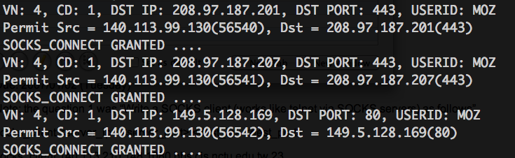
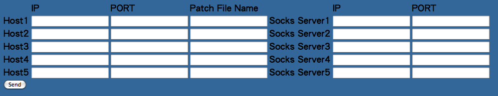

Project summary
---------------
1. Put the SOCKS client into your CGI program in Project 3-1.
   The web page needs extra fields for SOCKS proxy IP and port for each server. 

2. Write a SOCKS server
   
    2.1. CONNECT Operation (use Web Browser)::

         [socks.conf]: permit c - - - -

    2.2. BIND Operation (use FTP client + normal mode)::

         [socks.conf]: permit b - - - -

3. Include the firewall rule (use Web Browser) in the server. ::

   [socks.conf]: permit c - - 140.113. -  #   [NCTU only]
   [socks.conf]: permit c - - 140.114. -  #   [NTHU only]

Additional Requirement:

  - Use the concurrent, connection-oriented paradigm.
  - Output necessary messages on the screen in the SOCKS server.

Due: 2014/1/12 (Monday)

Detail
------
[SOCKS Server : CONNECT] (15 points)
++++++++++++++++++++++++++++++++++++

1. 開 Chrome, 可以連到google首頁 

2. 開 Chrome, 設定你的socks server, 設好之後

   (1) 連google首頁隨便搜尋某個頁面（正常）                      (5 points)
   (2) socks server斷線，再隨便點某個連結（失敗）                (5 points)
   (3) socks server連線，再點同一個連結（正常）                  (5 points)

[SOCKS Server : BIND] (15 points)
++++++++++++++++++++++++++++++++++++

1. 開FTP (使用FlashFXP)，設定
   [Options]-[Preferences]-[Connection]-[Proxy]-[Add]-[Type:Socks 4]，填入你的socks server
   連到一個ftp 之後

   (1) 上傳 up_file1，上傳成功後看 size 是否相同或改檔名為 .pdf 看能不能開   (5 points)
   (2) 下載 down_file1，下載成功後看 size 是否相同或改檔名為 .pdf 看能不能開 (5 points)
   (3) 看 SOCKS Server 的 output 是否有用 [BIND] protocol                    (5 points)

note:
    1. 請不要用FileZilla
    2 .請使用FlashFXP

[SOCKS Server : Messages] (5 points)
++++++++++++++++++++++++++++++++++++

Server 需顯示相關資訊，例如以下::

    <S_IP>    : source ip
    <S_PORT>  : source port
    <D_IP>    : destination ip
    <D_PORT>  : destination port
    <Command> : CONNECT or BIND
    <Reply>   : Accept or Reject
    <Content> : Redirect socket data (show partial data ---> do not need show all)

範例:

[CGI SOCKS Client] (25 points)
++++++++++++++++++++++++++++++++++++

1. 連到自己的帳號下的 form_get2.htm，可以輸入五欄的 IP , port , filename , SocksIP , SocksPort
2. 透過socks server連到五台機器看輸出是否正常

Test Case (the same as Project III)

1. t1.txt (5 points)
2. t2.txt (5 points)
3. t3.txt (5 points)
4. t4.txt (5 points)
5. t5.txt (5 points)

[firewall] (10 points)
++++++++++++++++++++++++++++++++++++

改變防火牆設定

    1. 只允許連到交大(140.113.*.*)，不能連到清大或其他 (5 points)
    2. 只允許連到清大(140.114.*.*)，不能連到交大或其他 (5 points)

Hint
----
[code: SOCKSServer]
流程:

- master socket(listener)不斷地listen，有連線(SRC)來就fork一個process(SOCKS) 去處理，然後繼續listen
- SOCKS 與 SRC 連線溝通

  1. 收 SOCKS4_REQUEST 格式封包
  2. check 是否可以過防火牆(socks.conf)，並回傳 SRC SOCKS4_REPLY
  3. (3-1) 如果是 CONNECT 模式:

       a. 從 REQUEST 裡取出 dest 的 IP 與 PORT
       b. SOCKS 連線到 DEST
       c. SOCKS 幫 SRC 與 DEST 做資料傳導的動作
          - SRC 傳來的資料 -> 傳給 DEST
          - DEST 傳來的資料 -> 傳給 SRC

  3. (3-2) 如果是 BIND 模式：

       a. SOCKS 先去 BIND 一個 port(BIND_PORT)
       b. SOCKS listen 該 port，回傳給 SRC 監聽 Port，DEST 就會自己連過來
       c. SOCKS accept DEST 之後，要再丟一個 SOCKS4_REPLY 給 SRC **[重要!!!!!!!!!]**
       d. SOCKS 幫 SRC 與 DEST 做資料傳導的動作
          - SRC 傳來的資料 -> 傳給 DEST
          - DEST 傳來的資料 -> 傳給 SRC

寫程式的注意事項

1. SOCKS_REQUEST, SOCKS_REPLY 的 protocol 要注意::

     1 byte: unsigned char
     2 byte: unsigned char[2]
     4 byte: unsigned char[4] 
   
2. port 格式::

     ex: port = 1234  

     unsigned char port[2]
     port[0] = 4
     port[1] = 210
     (hint : (int)port = port[0]*256 + port[1] ==> 1234 = 4*256 + 210)
  
3. IP 格式::

     ex: IP = 140.113.1.2
     
     unsigned char IP[4]
     IP[0] = 140
     IP[1] = 113
     IP[2] = 1
     IP[3] = 2

4. BIND mode 裡, 要確定 client 與 server 的連線建好了再開始傳資料

5. 測試請不要用 FileZilla
   建議使用 FlashFXP
   (link : http://www.flashfxp.com/)

[code: CGI Socks Client]
原本連到 rsh server，現在變成連到 socks server，
然後把要連到 rsh server 的 IP, port 放在 SOCKS_REQUEST 裡傳給 socks server，讓他去重導。
畫面如下: 

